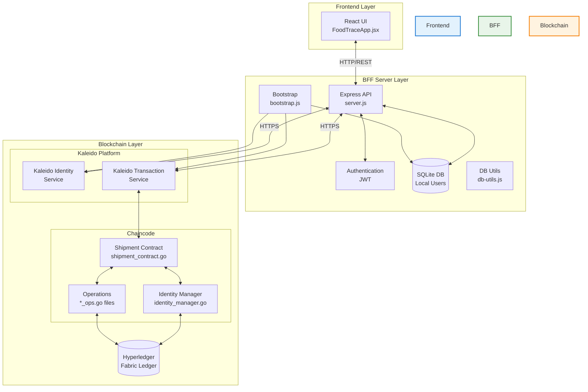
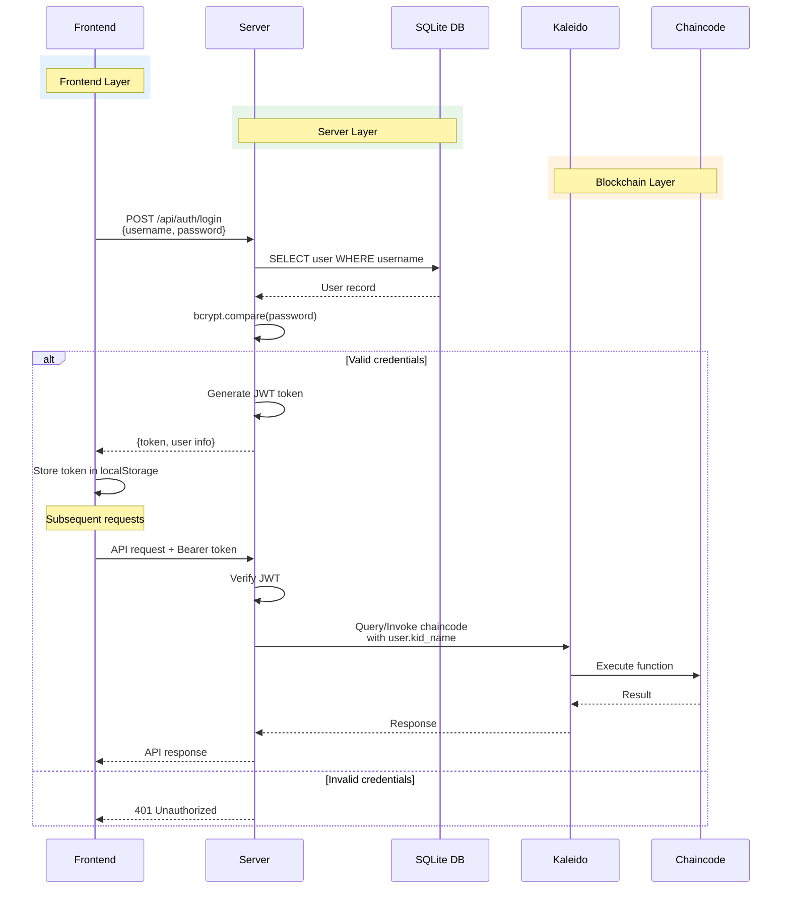
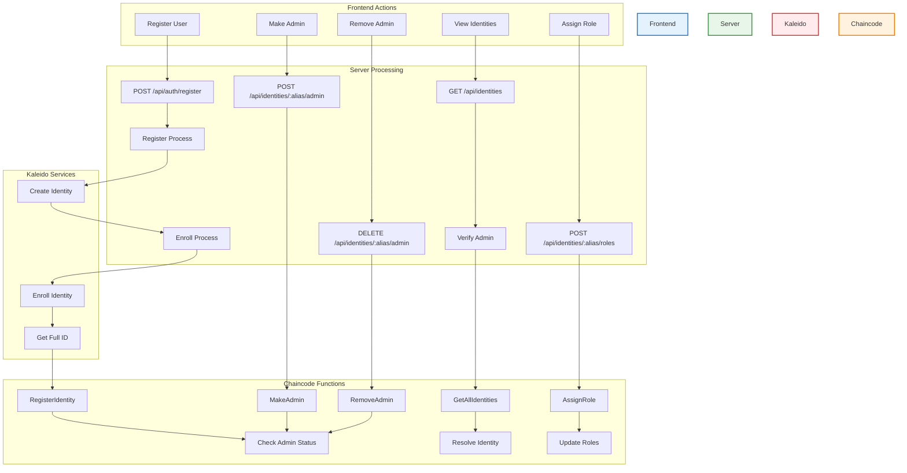
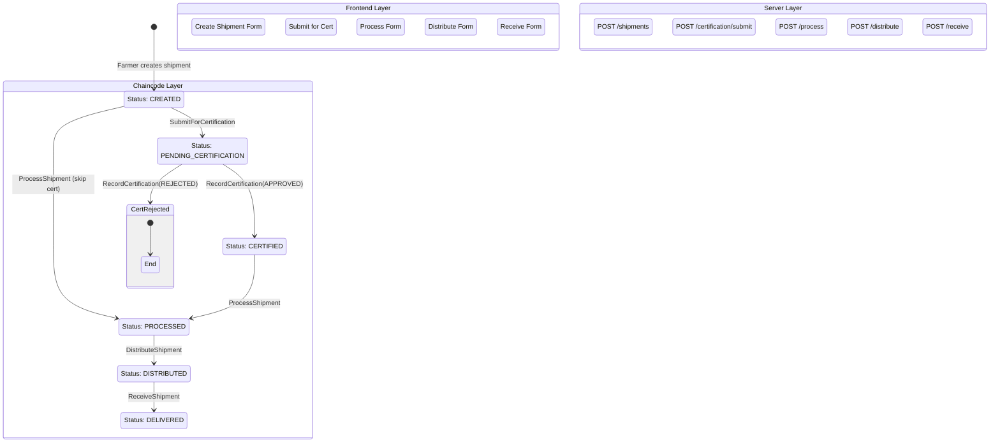
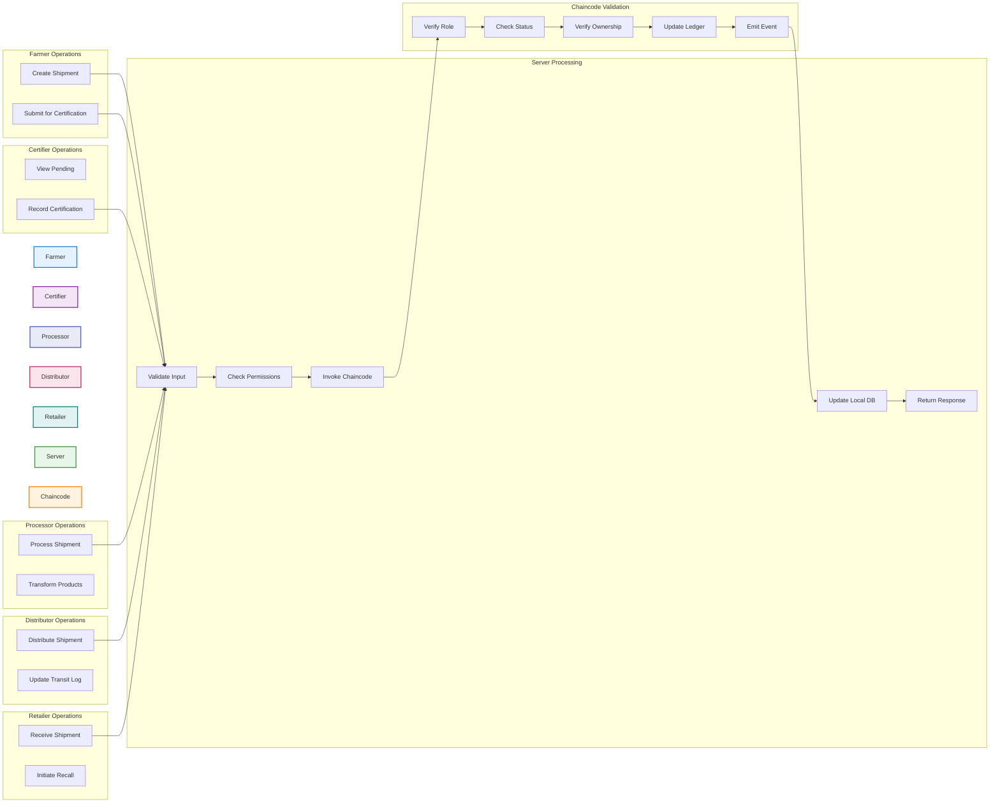
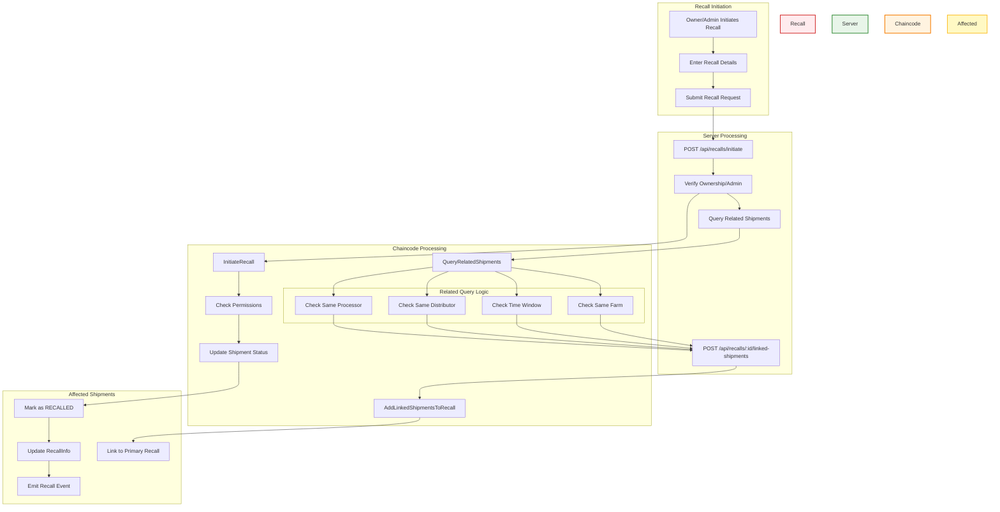
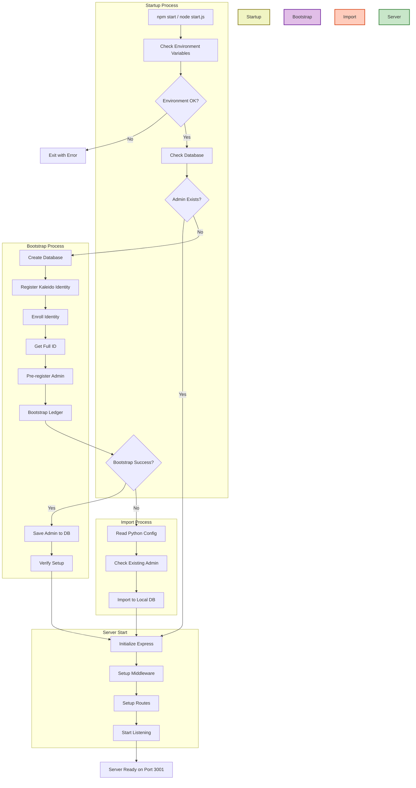
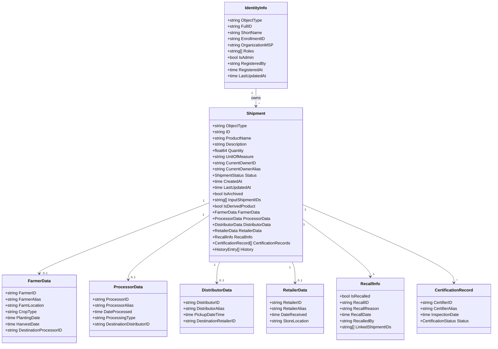
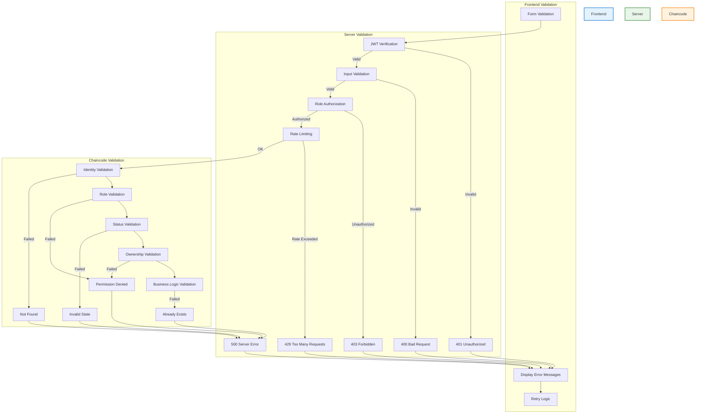

I'll create comprehensive Mermaid visualizations for the FoodTrace supply chain system. Let me break this down into multiple logical flowcharts that clearly differentiate between frontend, server, and chaincode layers.

## 1. System Architecture Overview



## 2. Authentication & Authorization Flow



## 3. Identity Management Flow



## 4. Shipment Lifecycle Flow



## 5. Detailed Shipment Operations Flow



## 6. Recall Management Flow



## 7. Bootstrap & Startup Flow



## 8. Component Interaction Diagram

```mermaid
graph TB
    subgraph "React Components"
        style React fill:#e3f2fd,stroke:#1976d2,stroke-width:2px
        MAIN[MainApp]
        DASH[DashboardView]
        SHIP[ShipmentsView]
        IDENT[IdentitiesView]
        ACT[ActionsView]
        
        MAIN --> DASH
        MAIN --> SHIP
        MAIN --> IDENT
        MAIN --> ACT
    end
    
    subgraph "API Endpoints"
        style API fill:#e8f5e9,stroke:#388e3c,stroke-width:2px
        
        subgraph "Auth"
            A1[/auth/login]
            A2[/auth/register]
        end
        
        subgraph "Identities"
            I1[/identities]
            I2[/identities/:alias]
            I3[/identities/:alias/roles]
            I4[/identities/:alias/admin]
        end
        
        subgraph "Shipments"
            S1[/shipments/all]
            S2[/shipments/my]
            S3[/shipments/:id]
            S4[/shipments - POST]
            S5[/shipments/:id/process]
            S6[/shipments/:id/distribute]
            S7[/shipments/:id/receive]
        end
        
        subgraph "Admin"
            AD1[/shipments/:id/archive]
            AD2[/shipments/:id/unarchive]
        end
        
        subgraph "Recalls"
            R1[/recalls/initiate]
            R2[/recalls/:id/linked-shipments]
            R3[/recalls/:id/related]
        end
    end
    
    DASH --> S1
    DASH --> S2
    SHIP --> S1
    SHIP --> S2
    SHIP --> S3
    SHIP --> AD1
    SHIP --> AD2
    SHIP --> R1
    
    IDENT --> I1
    IDENT --> I3
    IDENT --> I4
    
    ACT --> S4
    ACT --> S5
    ACT --> S6
    ACT --> S7
```

## 9. Chaincode Data Model



## 10. Error Handling & Validation Flow



These Mermaid diagrams provide a comprehensive visualization of the FoodTrace system, clearly showing the separation between:
- **Frontend (Blue)**: React components and user interactions
- **Server/BFF (Green)**: Express API, authentication, and local database
- **Chaincode (Orange)**: Hyperledger Fabric smart contracts and blockchain logic

Each diagram focuses on a specific aspect of the system, making it easier to understand the complex interactions and data flows throughout the application.