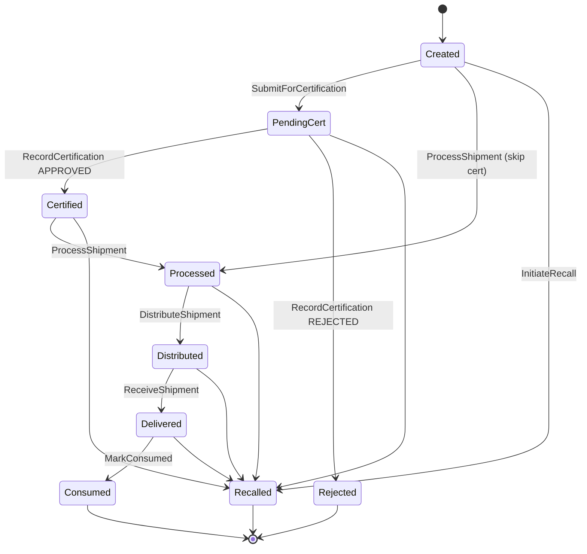
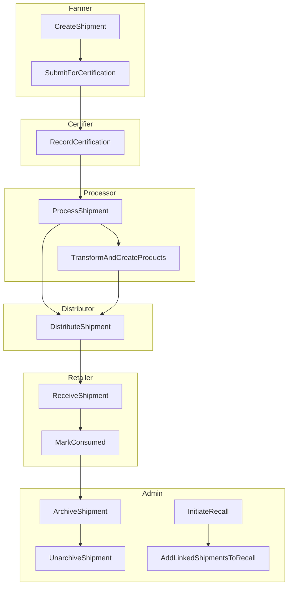
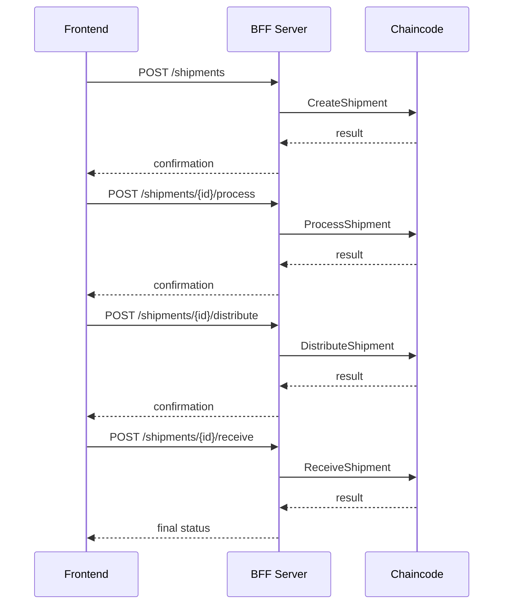
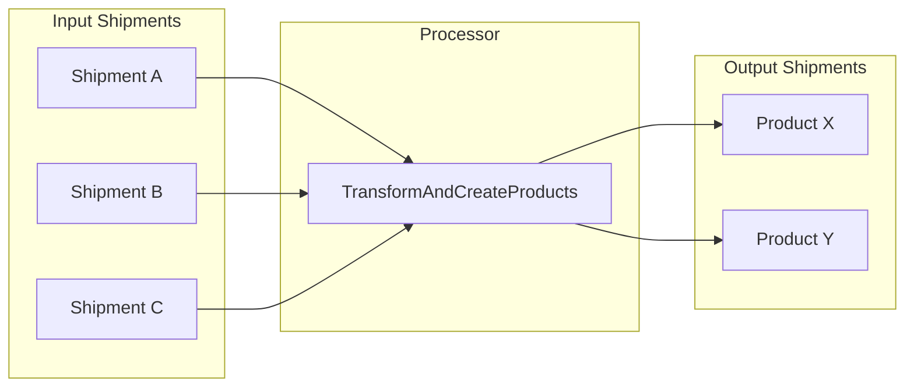
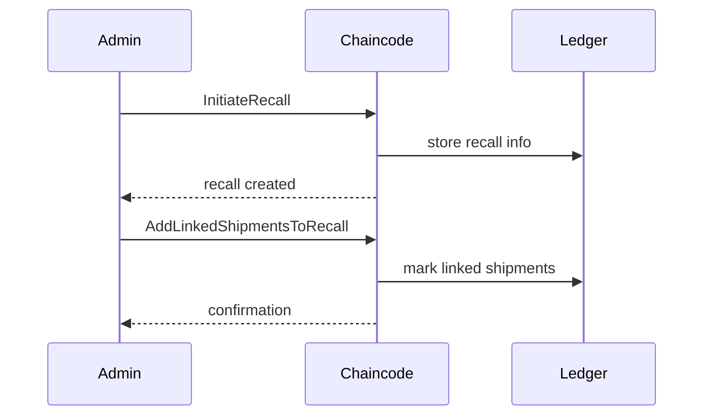
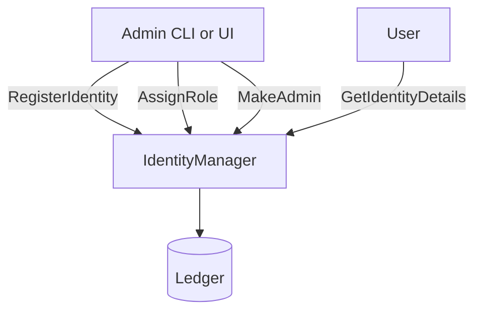
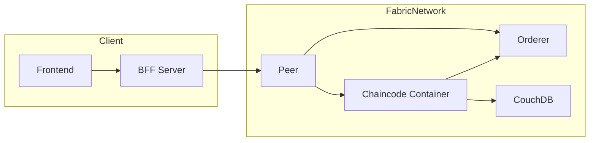
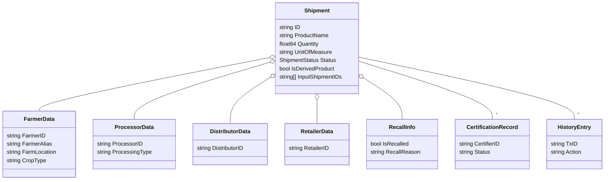

# Shipment Route Diagrams

Below are several Mermaid diagrams illustrating how shipments move through the chaincode. Each diagram shows the flow at a different level of detail.

## 1. High-Level Shipment Lifecycle

## 2. Detailed Chaincode Routes

## 3. BFF to Chaincode Interaction (Single Shipment Path)

## 4. Multi‑Shipment Transformation

## 5. Recall Process Sequence

## 6. Identity and Role Management

## 7. Hyperledger Fabric Deployment

## 8. Shipment Data Model

